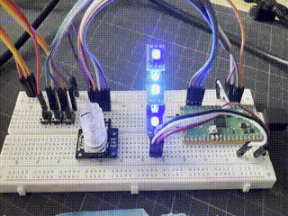

# Pico LED Control

Simple LED Control project for Raspberry Pi Pico.



- [Hardware](#hardware)
- [Usage](#usage)
- [Before you start](#before-you-start)
- [Prepare build environment](#prepare-build-environment)
- [Grab the Pimoroni libraries](#grab-the-pimoroni-libraries)
- [Clone this repository](#clone-this-repository)
- [Prepare project environment](#prepare-project-environment)
- [Build](#build)
- [Flash](#flash)

## Hardware

- Raspberry Pi [Pico](https://shop.pimoroni.com/products/raspberry-pi-pico) or [Pico W](https://shop.pimoroni.com/products/raspberry-pi-pico-w)
- Sparkfun [RGB Rotary Encoder](https://shop.pimoroni.com/products/rotary-encoder-illuminated-rgb) with built-in push button, and optionally the [breakout](https://shop.pimoroni.com/products/sparkfun-rotary-encoder-breakout-illuminated-rg-rgb)
- A WS2812/SK6812 [LED strip](https://shop.pimoroni.com/collections/components?tags=LED%20Strip) or a bunch of [NeoPixels](https://www.adafruit.com/category/168)
- Read [the uberguide](https://learn.adafruit.com/adafruit-neopixel-uberguide)
- Optional: An extra button if you want to load/save your colour schemes.
- Optional: [Captain Resetti](https://shop.pimoroni.com/products/captain-resetti-pico-reset-button) to return to default colours, or just replug the board.

### Connections

Only a single (right) side of the Pico is used for connections to allow for creative mounting options.

- WS2812/SK6812 LED strip: Data on GP28. Power with 5V and GND.
- Rotary Encoder with LED and button: 8 connections, believe or not!
  - LED connections: Red to GP18, Green to GP19, Blue to GP21
  - LED common anode to 3.3v (Pin 36)
  - Rotary encoder: A to GP16, B to GP17, C to GND (Pin 23)
  - SW to GP20
- Optional: Button "B" to GP27. Connect the other end of the button to any GND pin.

Pinout diagram is [here](./doc/pinout.png) or [from the back](./doc/pinout-back.png) (courtesy of [pinout.xyz](https://pico.pinout.xyz/))

## Usage

### TL;DR
- Pushing the rotary encoder in changes menu mode (choose setting or adjust chosen setting)
- Button "B" resets effects to default settings. You could also reset the Pico to achieve the same effect.
- Board LED is lit when cycling is stopped.
- Hold button "B" for 2 seconds to save current settings to flash. These will be loaded on boot, and will be used as default settings.

### Explanation

Encoder LED colours indicate the current mode. If the LED is blinking, moving the encoder will change the chosen setting. If the LED is solid, moving the encoder will switch between different settings you can adjust.

The modes are:

- Off: Encoder disabled.
- Green*: Encoder is primed to change the start colour on the colour wheel.
- Yellow*: Encoder is primed to change the end colour on the colour wheel.
- White/grey: You're changing the brightness.
- Red: You're now changing the cycling speed.
- Purple*: You're selecting an effect.

In the `*` designated modes, cycling of colours is stopped with the first encoder click and the board LED is lit. Get out of the edit mode by pressing the encoder in, to re-enable.

Cycling remains as-is when you're changing brightness or speed.

Tip: Double-click the Captain Resetti to put it in bootloader mode.

## Before you start

It's easier if you make a `pico` directory or similar in which you keep the SDK, Pimoroni Libraries and your projects alongside each other. This makes it easier to include libraries.

## Prepare build environment

Install build requirements:

```bash
sudo apt update
sudo apt install cmake gcc-arm-none-eabi build-essential
```

And the Pico SDK:

```
git clone https://github.com/raspberrypi/pico-sdk
cd pico-sdk
git submodule update --init
export PICO_SDK_PATH=`pwd`
cd ../
```

The `PICO_SDK_PATH` set above will only last the duration of your session.

You should ensure your `PICO_SDK_PATH` environment variable is set by `~/.profile`:

```
export PICO_SDK_PATH="/path/to/pico-sdk"
```

## Grab the Pimoroni libraries

```
git clone https://github.com/pimoroni/pimoroni-pico
cd pimoroni-pico
git submodule update --init
cd ..
```

## Clone this repository

```
git clone https://github.com/disq/ledcontrol
cd ledcontrol
git submodule update --init
```

## Prepare project environment

In `ledcontrol` directory:

```
mkdir build
cd build
cmake ..
```

for Pico W, use `cmake -DPICO_BOARD=pico_w ..` instead.

## Build

```
cd build
make ledcontrol
```

## Flash

Hold down the BOOTSEL button on the Pico and plug it into your computer. The Pico will appear as a USB drive called `RPI-RP2`. Copy the `ledcontrol.uf2` file to the root of the drive.

for macOS Ventura, try:
```
cd build
/bin/cp -X ledcontrol.uf2 /Volumes/RPI-RP2/
```
