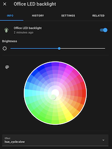

# Pico LED Control

Simple LED Control project for Raspberry Pi Pico and Pico W with MQTT (and Home Assistant auto-discovery).

 

- [Hardware](#hardware)
- [Usage](#usage)
- [Before you start](#before-you-start)
- [Prepare build environment](#prepare-build-environment)
- [Grab the Pimoroni libraries](#grab-the-pimoroni-libraries)
- [Clone this repository](#clone-this-repository)
- [Prepare project environment](#prepare-project-environment)
- [Build](#build)
- [Flash](#flash)

## Hardware

- Raspberry Pi [Pico](https://shop.pimoroni.com/products/raspberry-pi-pico) or [Pico W](https://shop.pimoroni.com/products/raspberry-pi-pico-w)
- A WS2812/SK6812 [LED strip](https://shop.pimoroni.com/collections/components?tags=LED%20Strip) or a bunch of [NeoPixels](https://www.adafruit.com/category/168)
- Optional: Sparkfun [RGB Rotary Encoder](https://shop.pimoroni.com/products/rotary-encoder-illuminated-rgb) with built-in push button, and optionally the [breakout](https://shop.pimoroni.com/products/sparkfun-rotary-encoder-breakout-illuminated-rg-rgb)
- Optional: An extra button (button "B") if you want to load/save your colour schemes.
- Optional: Another extra button (let's call this "C") if you want an instant on/off button.
- Optional: [Captain Resetti](https://shop.pimoroni.com/products/captain-resetti-pico-reset-button) to return to default colours, or just replug the board.
- Optional: [DFRobot mmWave Radar](https://shop.pimoroni.com/products/mmwave-radar-human-presence-detection-9m) to turn on/off the lights when you enter/leave the room.
- Read [the uberguide](https://learn.adafruit.com/adafruit-neopixel-uberguide) if you haven't...

### Connections

Only a single (right) side of the Pico is used for connections to allow for creative mounting options.

- WS2812/SK6812 LED strip: Data on `GP28`. Power with 5V (`VSYS` in a pinch) and `GND`.
- (Optional on the Pico W) Rotary Encoder with LED and button: 8 connections, believe or not!
  - LED connections: Red to `GP18`, Green to `GP19`, Blue to `GP21`
  - LED common anode to `3v3` (Pin 36)
  - Rotary encoder: A to `GP16`, B to `GP17`, C to `GND` (Pin 23)
  - SW to `GP20`
- Optional: Button "B" to `GP27`. Connect the other end of the button to any `GND` pin.
- Optional: Button "C" to `GP26`. Connect the other end of the button to any `GND` pin.
- Optional: mmWave Radar TX to `GP5`, RX to `GP4`. Connect `G` to any `GND` pin and `V` to power (Pin 36).
  - You can optionally connect `IO2` pin to `GP22` (see `PRESENCE_PIN`) and get more reliable results (reading UART takes time away from TCP tasks)
  - You can also use another way of detecting presence, just set UART pins in `config.h` to 0.

Pinout diagram is [here](./doc/pinout.png) or [from the back](./doc/pinout-back.png) (courtesy of [pinout.xyz](https://pico.pinout.xyz/))

## Usage

### TL;DR
- Pushing the rotary encoder in changes menu mode (choose setting or adjust chosen setting)
- Button "B" resets effects to default settings. You could also reset the Pico to achieve the same effect.
- Board LED is lit when cycling is stopped.
- Hold button "B" for 2 seconds to save current settings to flash. These will be loaded on boot, and will be used as default settings.
- Button "C" to turn LEDs on/off quickly.

### Explanation

Encoder LED colours indicate the current mode. If the LED is blinking, moving the encoder will change the chosen setting. If the LED is solid, moving the encoder will switch between different settings you can adjust.

The modes are:

- Off: Encoder disabled.
- Yellow*: Encoder is primed to change the start colour on the colour wheel.
- Orange*: Encoder is primed to change the end colour on the colour wheel.
- White/grey: You're changing the brightness.
- Red: You're now changing the cycling speed.
- Purple*: You're selecting an effect.

In the `*` designated modes, cycling of colours is stopped with the first encoder click and the board LED is lit. Get out of the edit mode by pressing the encoder in, to re-enable.

Cycling remains as-is when you're changing brightness or speed.

Tip: Double-click the Captain Resetti to put it in bootloader mode.

## Before you start

It's easier if you make a `pico` directory or similar in which you keep the SDK, Pimoroni Libraries and your projects alongside each other. This makes it easier to include libraries.

## Prepare build environment

Install build requirements:

```bash
sudo apt update
sudo apt install cmake gcc-arm-none-eabi build-essential
```

And the Pico SDK:

```bash
git clone https://github.com/raspberrypi/pico-sdk
cd pico-sdk
git checkout develop # Switch to develop branch
git submodule update --init
export PICO_SDK_PATH=`pwd`
cd ../
```

The `PICO_SDK_PATH` set above will only last the duration of your session.

You should ensure your `PICO_SDK_PATH` environment variable is set by `~/.profile`:

```bash
export PICO_SDK_PATH="/path/to/pico-sdk"
```

## Grab the Pimoroni libraries

```bash
git clone https://github.com/pimoroni/pimoroni-pico
cd pimoroni-pico
git submodule update --init
cd ..
```

## Clone this repository

```bash
git clone https://github.com/disq/ledcontrol
cd ledcontrol
git submodule update --init
```

## Prepare project environment

See `config.h` to configure number of LEDs and defaults, or to customize the pins used.

Then in `ledcontrol` directory:

```bash
mkdir build
cd build
cmake ..
```

### Compiling for Pico W

- For Pico W you need to define `PICO_BOARD`, `WIFI_SSID` and `WIFI_PASSWORD` during cmake (see below).

- Edit `config_iot.h` to change MQTT server and options.

- Then run:
`cmake -DPICO_BOARD=pico_w -DWIFI_SSID=your_ssid -DWIFI_PASSWORD=your_password ..`

#### Home Assistant Configuration

The project supports Home Assistant MQTT Discovery. After it's connected to your MQTT broker it will publish a self-identifying message to the `homeassistant` topic under the `light` category.

The default discovery MQTT prefix is `homeassistant/light/` and can be changed in `config_iot.h`.


##### Manual Home Assistant Configuration

If you don't have MQTT discovery enabled, manual configuration is as follows.

- Add the following to your `configuration.yaml`:

```yaml
mqtt:
  light:
    - schema: json
      name: LED light
      unique_id: picow_ledcontrol1
      state_topic: 'picow/ledcontrol'
      command_topic: 'picow/ledcontrol/set'
      brightness: true
      brightness_scale: 100
      color_mode: true
      supported_color_modes: ["hs"]
      effect: true
      effect_list:
        - 'hue_cycle:stopped'
        - 'hue_cycle:superslow'
        - 'hue_cycle:slow'
        - 'hue_cycle:medium'
        - 'hue_cycle:fast'
        - 'white_chase:stopped'
        - 'white_chase:superslow'
        - 'white_chase:slow'
        - 'white_chase:medium'
        - 'white_chase:fast'
      icon: 'mdi:led-strip-variant'
      optimistic: false
```

`MQTT_ADD_BOARD_ID_TO_TOPIC` is enabled by default (in `config_iot.h`) so the final topic name will be different from the example above. To find out what it is, see [troubleshooting](#Troubleshooting).

If using multiple Pico Ws using this code, you should:

- Change `unique_id` to a unique value
- Either define `MQTT_ADD_BOARD_ID_TO_TOPIC` in `config_iot.h` (on by default), or set different names for `MQTT_TOPIC_PREFIX` (or both). Update `state_topic` and `command_topic` in `configuration.yaml` accordingly.
- Let me know if I missed something by [opening an issue](https://github.com/disq/ledcontrol/issues/new) ;-)


## Build

```bash
cd build
make ledcontrol
```

## Flash

Hold down the BOOTSEL button on the Pico and plug it into your computer. The Pico will appear as a USB drive called `RPI-RP2`. Copy the `ledcontrol.uf2` file to the root of the drive.

for macOS Ventura, try:
```bash
cd build
/bin/cp -X ledcontrol.uf2 /Volumes/RPI-RP2/
```

## Troubleshooting

Connect the Pico to the USB and use a terminal emulator (I use `screen` which might not be the friendliest...) to connect to the Pico's serial port and follow the messages.
